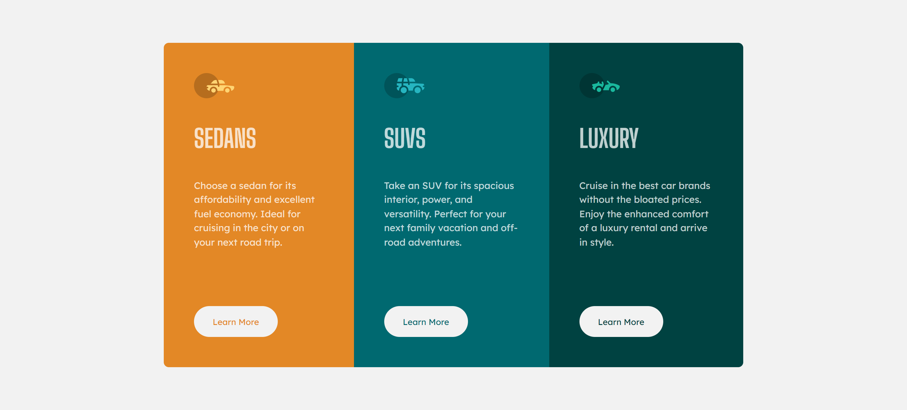

# Frontend Mentor - 3-column preview card component solution

This is my second take to a solution to the [3-column preview card component challenge on Frontend Mentor](https://www.frontendmentor.io/challenges/3column-preview-card-component-pH92eAR2-). Frontend Mentor challenges help you improve your coding skills by building realistic projects. 

## Table of contents

- [Overview](#overview)
  - [The challenge](#the-challenge)
  - [Screenshot](#screenshot)
  - [Links](#links)
- [My process](#my-process)
  - [Built with](#built-with)
- [Author](#author)
- [Changes](#changes)
- [Acknowledgements](#acknowledgements)

## Overview

### The challenge

Users should be able to:

- View the optimal layout depending on their device's screen size
- See hover states for interactive elements

### Screenshot

### Links

- Live Site URL: [3-column preview card component](https://stirring-seahorse-411e78.netlify.app/)

## My process

### Built with

- Semantic HTML5 markup
- CSS custom properties
- Flexbox
- Mobile-first workflow

## Author

- Frontend Mentor - [@yMitko90](https://www.frontendmentor.io/profile/mitko90)

## Changes

Here is what I did differently onmy second take

- Removed the `article` element from thepage after I was toldit was being used incorrectly.
- Changed my `h1` headings to `h2` as it can be reused.
- Added a visually hidden `h1` title so I don't get accessibility warnings.
- Changed my `<button class="btn">` to `<a href="#" class="btn">` as these buttons are supposed to be directing viewers to a different part of the site.
- I changed the `px` value in my `@media` to `em` for imroved accessibility.

## Acknowledgements

This is the part where I would like to thank [@vcarames](https://www.frontendmentor.io/profile/vcarames) for all the suggested changes to improve my coding.

